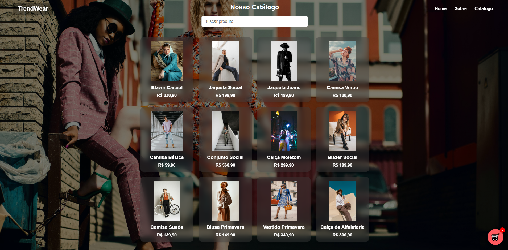
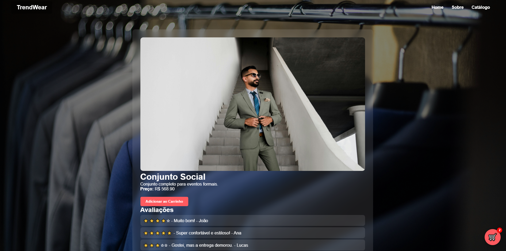
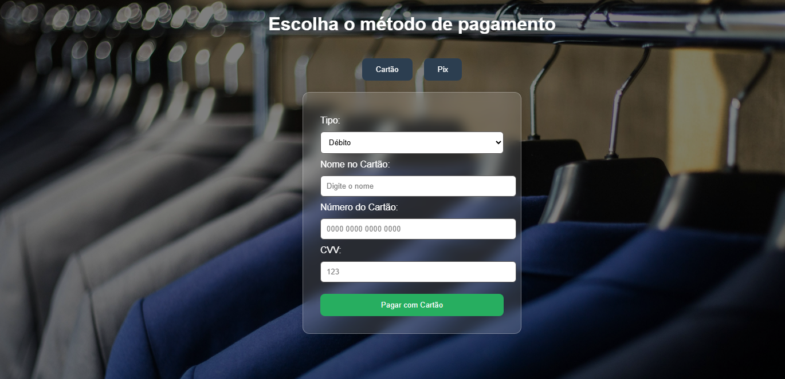

# 🧥 TrendWear


> Projeto de site de e-commerce focado em moda, desenvolvido como protótipo interativo com funcionalidades completas de navegação, cadastro/login, exibição de produtos e carrinho de compras.

---

## 📸 Prévia do Projeto

###  Página Catalogo


###  Página do Produto


###  Pagamento


---

## 🔗 Páginas

- `login.html` – Tela de autenticação do usuário.
- `cadastro.html` – Tela de cadastro de novos usuários.
- `home.html` – Página inicial com destaque de campanha.
- `sobre.html` – Apresentação institucional da TrendWear.
- `produto.html` – Exibição individual do produto com carrinho flutuante.
- `catalogo.html` – Exibição de todos os produtos da loja.
- `pagamento.html` – Mostra a folha de pagamento geral e finalização da compra.

---

## 🛍️ Funcionalidades

- ✅ Login/Cadastro funcional (simulado)
- ✅ Carrinho flutuante interativo com total dinâmico
- ✅ Compartilhamento de produtos via `navigator.share`
- ✅ Avaliações de clientes (mock)
- ✅ Responsivo (adaptação a dispositivos móveis)
- ✅ Organização modular com CSS e JS externos

---

## 💼 Tecnologias Utilizadas

| Linguagem | Descrição |
|----------|-----------|
| HTML5    | Estrutura das páginas |
| CSS3     | Estilização moderna e responsiva |
| JavaScript | Lógica de interação (carrinho, eventos, localStorage) |

---

## 🧑‍💻 Desenvolvedores

- **Alex Golçalves Filho**
- **Dan Cezar Carvalho**
- **Gabriel Lobo Baia**
- **Luiz Eduardo Martins**
- **Maria Luiza Rodrigues**

---

## 🚀 Como Rodar o Projeto Localmente

```bash
# 1. Clone o repositório
git clone https://github.com/luispeky/trendwear.git

# 2. Acesse o diretório
cd trendwear

# 3. Abra o arquivo inicial com navegador (ex: home.html)
